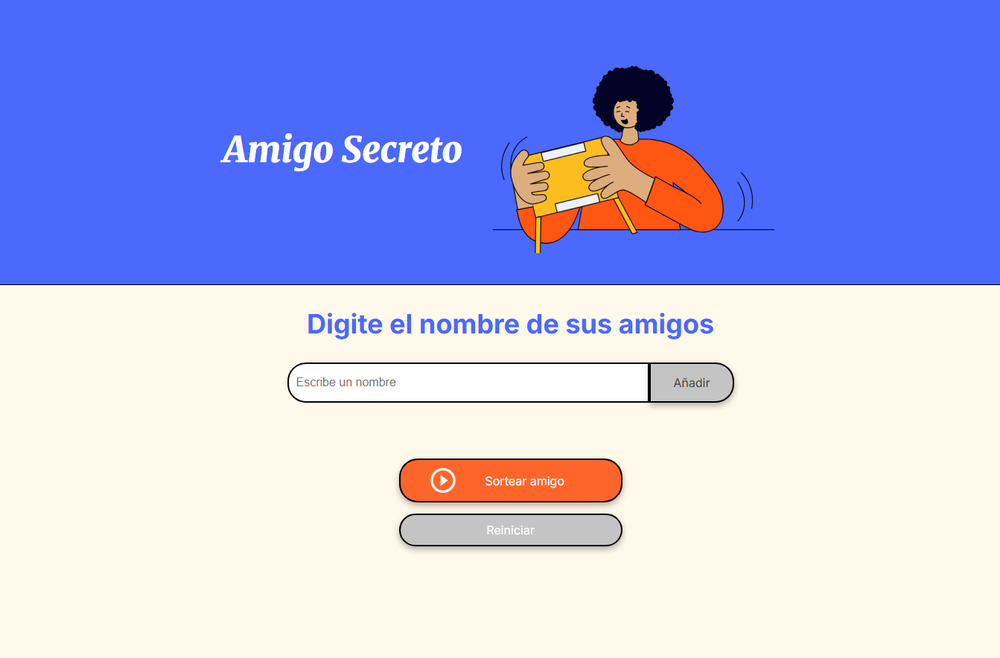

# Amigo Secreto

Una aplicación web simple para realizar sorteos de "Amigo Secreto" entre amigos. Permite agregar nombres a una lista y seleccionar uno aleatoriamente.




## Características

- **Agregar nombres:** Los usuarios pueden escribir el nombre de un amigo en un campo de texto y agregarlo a una lista visible.
- **Validación de entrada:** El sistema valida que solo se ingresen caracteres válidos para nombres en español latino (letras, acentos, espacios, guiones y apóstrofes).
- **Visualización de la lista:** Los nombres ingresados aparecen en una lista debajo del campo de entrada.
- **Sorteo aleatorio:** Al hacer clic en "Sortear Amigo", se selecciona aleatoriamente un nombre de la lista y se muestra como resultado.
- **Interacción amigable:** Soporte para agregar nombres presionando Enter, enfoque automático para entradas rápidas y retroalimentación visual inmediata.

## Tecnologías utilizadas

- HTML5
- CSS3
- JavaScript

## Instalación

1. Clona este repositorio:
   ```bash
   git clone https://github.com/usuario/amigo-secreto.git
   ```
2. Abre el archivo `index.html` en tu navegador web.

¡Ya puedes comenzar a usar la aplicación!

## Uso

1. Escribe el nombre de un amigo en el campo de texto (solo se permiten caracteres válidos para nombres).
2. Haz clic en "Añadir" o presiona Enter para agregarlo a la lista.
3. Repite los pasos 1 y 2 para todos los amigos que desees incluir en el sorteo.
4. Cuando estés listo, haz clic en "Sortear amigo" para seleccionar aleatoriamente uno de los nombres.
5. El resultado se mostrará debajo de la lista de amigos.

## Estructura del proyecto

```plaintext
amigo-secreto/
├── assets/
│   ├── amigo-secreto.png
│   └── image.png
│   └── play_circle_outline.png
├── index.html
├── style.css
├── app.js
└── README.md
```

## Funcionalidades técnicas

- Validación de entrada en tiempo real utilizando expresiones regulares.
- Manipulación dinámica del DOM para actualizar la interfaz.
- Algoritmo de selección aleatoria para el sorteo.
- Manejo de eventos para mejorar la experiencia de usuario.
- Compatibilidad con caracteres especiales del español latino.

